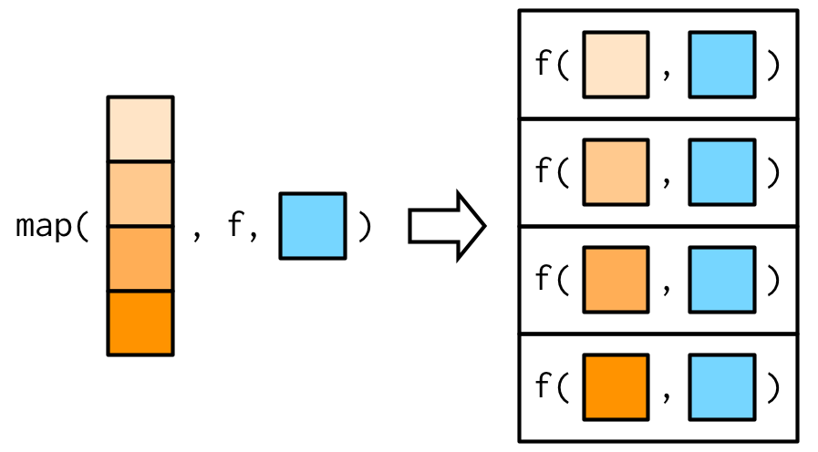

## Introduction

You have seen the logic of Logistic Regressions with Professor Rovny in the lecture. In this lab session, we will understand how to apply this logic to R and how to build a model, interpret and visualize its results and how to run some diagnostics on your models. 

If the time allows it, I will also show you how to automate the construction of your model and run several logistic regressions for many countries at once.

These are the main points of today's session and script: 

1. Getting used to the European Social Survey
2. Cleaning data: dropping rows, columns, creating and mutating variables
3. Building a generalized linear model (`glm()`); special focus on logit
4. Extracting and interpreting the coefficients
5. Visualization of results
6. Introduction to the `purrr` package and automation in RStudio (OPTIONAL!)

## Data Management & Data Cleaning
We will gradually increase the data mangement part from now on. It is integral to R and operationalizing our quantitative questions in models. A properly cleaned data set is worth a lot. This time we will work on how to drop values of variables (and thus rows of our dataset) which we are either not interested in or, most importantly, because they skew our estimations. 


```{r}
library(tidyverse)
```


## Importing the data
In the first session, I have covered how to import a dataset. Create an `.Rproj` of your choice and create a folder in which the dataset of this lecture resides. You can download this dataset from our Moodle page. I have pre-cleaned it a bit. If you were to download this wave of the European Social Survey from the Internet, it would be a much bigger data set. I encourage you to do this and try to figure out ways to manipulate your data but for now, we'll stick to the slightly cleaner version.

```{r}
# importing the data; if you are unfamiliar with this operator |> , ask me or
# go to my document "Recap of RStudio" which you can find on Moodle
ess <- read_csv("ESS_10_fr.csv")
```

As you can see from the dataset's name, we are going to work with the *European Social Survey*. It is the biggest, most comprehensive and perhaps also most important survey on social and political life in the European Union. It comes in waves of two years and all the European states which want to pay for it produce their own data. In fact, the French surveys (of which we are going to use the most recent, 10th wave) are produced at SciencesPo, at the Centre de Données Socio-Politiques (CDSP)!

The ESS is extremely versatile if you need a broad and comprehensive data set for both national politics in Europe or to compare European countries. Learning how to use it, how to manage and clean the ESS waves will give you all the instruments to work with almost any data set that is "out there". Also, some of you might want to use the ESS waves for your theses or research papers. There is a lot that can be done with it, not only cross-sectionally but also over time. So give it a try :)

Enough advertisement for the ESS, let's get back to wrangling with our data! As always, the first step is to inspect ("glimpse") at our data and the data frame's structure. We do this to see if obvious issues arise at a first glance. 

```{r}
glimpse(ess)
```

As we can see, there are many many variables (25 columns) with many many observations (33351). Some are quite straight-forward and the name is clear ("essround", "age") and some much less. Sometimes we can guess the meaning of a variable's name. But most of the time -- either because guessing is too annoying or because the abbreviation is not making any sense -- we need to turn to the documentation of the data set. You can find the documentation of this specific version of the data set in an html-file on Moodle (session 2).

Every (good and serious) data set has some sort of documentation somewhere. If not, it is not a good data set and I am even tempted to say that we should be careful in using it! The documentation for data sets is called a *code book*. Code books are sometimes well crafted documents and sometimes just terrible to read. In this class, you will be exposed to both kinds of code books in order to familiarize you with both.

In fact, this dataframe still contains many variables which we either won't need later on or that are simply without any information. Let's get rid of these first. This is a step which you can also do later on but I believe that it is smart to this right at the beginning in order to have a neat and tidy data set from the very beginning.

You can select variables (`select()`) right at the beginning when importing the csv file.

```{r}
ess <- read_csv("ESS_10_fr.csv")  |>
  dplyr::select(
    cntry,
    polintr,
    trstplt,
    trstprt,
    vote,
    prtvtefr,
    clsprty,
    gndr,
    yrbrn,
    eduyrs,
    emplrel,
    uemp12m,
    uemp5yr
  )
```

However, I am realizing that when looking at the number of rows that my file is a bit too large for only one wave and only one country. By inspecting the `ess$cntry` variable, I can see that I made a mistake while downloading the dataset because it contains *all* countries of wave 10 instead of just one. We can fix this really easily when importing the dataset: 

```{r}
ess <- read_csv("ESS_10_fr.csv") |>
  dplyr::select(
    cntry,
    polintr,
    trstplt,
    trstprt,
    vote,
    prtvtefr,
    clsprty,
    gndr,
    yrbrn,
    eduyrs,
    emplrel,
    uemp12m,
    uemp5yr
  ) |>
  filter(cntry == "FR")
```

This only leaves us with the values for France!


#### Cleaning our DV
At this point, you should all check out the codebook of this data set and take a look at what the values mean. If we take the variable of `ess$vote` for example, we can see that there are many numeric values of which we can make hardly any sense (without guessing and we don't do this over here) of what they might stand for.

```{r}
summary(ess$vote) 
# remember that you can summary() both dataframes and individual variables
```

Or in a table containing the amount of times that a value was given: 
```{r}
table(ess$vote)
```
Here we can see that the variable vote contains the numeric values of 1 to 3 and then 7, 8, and 9. If we take a look at the code book, we can see what they stand for: 

- 1 = yes (meaning that the respondent voted)
- 2 = no (meaning that the respondent did **not** vote)
- 3 = not eligible to vote
- 7	= Refusal
- 8 = Don't know
- 9 = No answer

The meaning behind the values of 7, 8, and 9 are quite common and you will find them in almost all data sets which were made out of surveys. Respondents might not want to give an answer, the answer was not able to be read, or they indicated that they did not remember. 

**Spoiler alert: We will work on voter turnout this session**: Therefore, we will try to see what makes people vote and what decreases the likelihood that they vote at election day. The question of our dependent variable will thus be: *Has the respondent voted or not?*. Mathematically, this question cannot be answered well with a linear regression which uses the OLS method as the dependent variable is *binary* meaning that 0 = has not voted/1 = has voted. There are only two possible outcomes, and a linear model would happily predict probabilities below 0 or above 1, which makes no sense for a binary outcome. 

But if we were to use the variable on voting turnout as it is right now, we would neither have a binary variable nor have a reliable variable as it contains values in which we are both not interested in and that will skew our estimations strongly. In fact, we cannot do a logistic regression (logit) on variables other than binary. 

Thus, we first need to transform our dependent variable. We need to get rid of unwanted values and transform the 1s and 2s in 0s and 1s.

First we will get rid of the unwanted values in which we are not interested. You could technically now filter out the values as shown below. I recommend not doing this but instead transforming the values within the variable to `NA`. These rows will be omitted in a regression but if ever you choose to run a second model with another dependent variable you risk losing observations that you have fully omitted/filtered out by using `filter()`. Therefore, you could take it as a rule of thumb to only filter for values if you are unsure you will never need them afterwards.

```{r}
#| eval: false

ess <- ess |>
  filter(!vote %in% c(3, 7, 8, 9))
```

Here we can mutate the values directly within the variable by using `case_when()` within the `mutate()` function. `case_when()` is a bit tricky to read at first. `case_when()` evaluates a series of conditions and applies the corresponding transformation to each element of a vector or column in a dataset. Inside of the function, you will have to specify at least one condition. You can also specify several conditions. Let's say you want the conditions to apply at the same time. In this case, you would have to put an `&` in between. If you want the condition to read as "either full-fill this condition or this second one" you would want to use `|`. You then specify a tilde `~` after which you can declare the new, mutated, value that the variable should take on if the condition is fulfilled. 

This is how it reads: 

```{r}
#| eval: false
case_when(
  condition1 ~ value_if_true1,
  condition2 ~ value_if_true2,
  TRUE ~ default_value
)
```

Let's look at an example below. I want the values 3, 7, 8, and 9 to take on `NA` as a value within the vote variable, as they are meaningless to our analysis. We open mutate, assign a column, which I will call like the old variable `vote`. Within this `case_when()`, I put `vote %in% c(3, 7, 8, 9) ~ NA_integer_`. This reads as follows: whenever vote contains the values of 3, 7, 8, or 9 assign it NA_integer. The following line `TRUE ~ vote` means that whenever that is not the case, I want to keep the values that `vote` initially already had. It is a sort of special catch-all rule: `TRUE ~ vote`. This is like saying, "For anyone else, or any situation I didn't mention, assign the initial vote values".

```{r}
ess <- ess |>
  mutate(
    vote = case_when(
      vote %in% c(3, 7, 8, 9) ~ NA_integer_,
      TRUE ~ vote
  ))

```


Quick check to see if we got rid of all the values:

```{r}
table(ess$vote)
```

Perfect, now we just need to transform the ones and twos into zeros and ones. This is both out of convention, my personal coding preference, and also to torture you with some more data management. Since we are interested in people who **did** vote, we will code those people as 1 and those who **did not** vote as 0. Let's do this with `case_when()` again. `case_when(vote == 1 ~ 1, vote == 2 ~ 0)` reads as follows: whenever vote is equal to 1 (meaning those that have voted), assign/keep it at 1; whenever vote is equal to 2, assign 0.

```{r}
ess <- ess |> 
  mutate(vote = case_when(
    vote == 1 ~ 1, 
    vote == 2 ~ 0, 
    TRUE ~ vote
  ))

table(ess$vote)
```


Thus, we now have our binary dependent variable necessary for a logit. The `table()` function shows that we have changed the values of the variable but the count stayed the same.

In Base R, you could do it like this but I believe that the `mutate()` function is probably the most elegant way of doing things... It's up to you though:

```{r, eval = FALSE}
# only use the ifelse() function
ess$vote <- ifelse(ess$vote == 1, 1, 0)

# This will leave the value of 1 at 1 and change 2 to 0 for the column vote.
ess$vote[ess$vote == 1] <- 1
ess$vote[ess$vote == 2] <- 0
```


We are very close to completing our data management part and to being able to finally work on our model. But we still have many many variables which are as "untidy" as our initial dependent variable was. We need to check in the code book if specific values that we cannot simply replace over the whole data frame are still void of interest. 

Our independent variables of interest: 

1. political interest (polintr): `c(7:9)` needs to be dropped
2. trust in politicians (trstplt): no recoding necessary (unwanted values already NAs)
3. trust in political parties (trstprt): already done
4. feeling close to a party (clsprty): transform 1/2 into 0/1, drop `c(7:8)`
5. gender (gndr): transform into 0/1 and drop the no answers
6. year born (yrbrn): already done
7. years of full-time education completed (eduyrs): already done

We will do every single step at once now using the pipes `%>%` (`tidyverse`) or `|>` (Base R) to have a tidy and elegant way of doing everything at once. I will also rerun the mutation of our dependent variable to demonstrate the flexibility of long pipe calls.

I open a `mutate()` in which I manipulate the independent variables we need for our model. Note how you can separate the different manipulations with a comma within the same function. This results in very clean and easy to read code. There are several different ways to do this. The `recode()`, `if_else()` and `case_when()` functions are all very useful for this kind of data wrangling. For the sake of clarity, I will use `case_when()` here. There is a newer version of this function called `case_match()`, but I prefer `case_when()`.

Now, let's talk about `NA_integer_`. In R, NA means "not available" or missing information. But R is very particular about the kind of data it deals with. If your variable is numeric, R wants to know that even your missing pieces should be numbers. Using `NA_integer_`is your way of telling R, "This is a missing piece of information, but if it were here, it would be a number." It helps keep everything organized and avoids confusion when R is looking through your data. There are also other instances (when recoding character strings for example), where you would use `NA_character_` instead. Pay attention that if you have numeric values with decimal points, you will have to use `NA_real_` instead of `NA_integer_`.

```{r}
ess_final <- ess |> 
  # mutating the dependent variable to get rid of any unnecessary rows
  # as we have done above
  mutate(
    vote = case_when(
      vote %in% c(3, 7, 8, 9) ~ NA_integer_,
      vote == 2 ~ 0,
      vote == 1 ~ 1, 
      TRUE ~ vote
    ),
    # Recode 'polintr' to drop values 7 to 9
    polintr = case_when(
      polintr %in% c(7:9) ~ NA_integer_,
      TRUE ~ polintr
    ),
    # Recode 'clsprty' 1/2 into 0/1 and drop 7, 8
    clsprty = case_when(
      clsprty == 1 ~ 0,
      clsprty == 2 ~ 1,
      clsprty %in% c(7, 8) ~ NA_integer_,
      TRUE ~ clsprty
    ),
    # Recode 'gndr' into 0/1 and handle other cases as NAs
    gndr = case_when(
      gndr == 1 ~ 0,
      gndr == 2 ~ 1,
      TRUE ~ NA_integer_
    ),
    # recode eduyrs
    eduyrs = case_when(
      eduyrs %in% c(1:55) ~ eduyrs,
      TRUE ~ NA_integer_
    ),
    # this one is very advanced...
    across(c(trstplt, trstprt), ~case_when(
      .x <= 10 ~ .x, 
      TRUE ~ NA_integer_
    ))
  )
```


### Constructing the logit-model
If you have made it this far and still bear with me, you have made it to the fun part! Specifying the model and running it, literally only takes one line of code (or two depending on the amount of independent variables). And as you can see, it is really straightforward. The `glm()` function stands for *generalized linear model* and comes with Base R. 

In Professor Rovny's lecture, we have seen that for a Maximum Likelihood Estimation (MLE) you need to know or have an assumption about the distribution of your dependent variable. And according to this distribution, you need to find the right linear model. If you have a binary outcome, your distribution is *binomial*. Within the function, we thus specify the family of the distribution as such. Note that you could also specify other families such as *Gaussian*, *poisson*, *gamma* or many more. We are not going to touch further on that but the `glm()` function is quite powerful. We can specify, within the `family = ` argument, that we are doing a logistic regression. This can be done by adding `link = logit` to the argument. If ever you wanted to be precise and call a *probit* or *cauchy* link, it is here that you can specify this. The standard, however, is set to *logit*, so we would technically not be forced to specify it in this case. If your dependent variable is not adapted for the model family you have chosen, the function will tell you that there is a problem somewhere. 

In terms of the model we are building right now, it follows the idea that voting behavior (voted/not-voted) is a function of political interest, trust in politicians, trust in parties, feeling close to a specific party, as well as usual control variables such as gender, age, and education: 

By no means is this regression just extensive enough to be published. It is just one example in which I suspect that political interest, trust in politics and politicians, and party affiliation are explanatory factors. Just like with an OLS regression, you first give the function your DV, in our case that is `vote`. Then you separate your DV from the independent variables using a `~`. After that you enumerate your predictors separating by a `+`. Lastly, you need to specify your data object and the model family.

```{r}
logit <- glm(
  vote ~ polintr + trstplt + trstprt + clsprty + gndr +
    yrbrn + eduyrs,
  data = ess_final,
  family = "binomial")
```

The object called `logit` contains our model with its coefficients, confidence intervals and many more things that we will play with! But as you can see, the actual construction of the model is more than simple...

```{r}
library(broom)
tidy(logit)
```

You have seen both the `broom` package as well as `stargazer` in the last session.

```{r}
stargazer::stargazer(
  logit,
  type = "text",
  dep.var.labels = "Voting Behavior",
  dep.var.caption = c("Voting turnout; 0 = abstention | 1 = voted"),
  covariate.labels = c(
    "Political Interest",
    "Trust in Politicians",
    "Trust in Parties",
    "Feeling Close to a Party",
    "Gender",
    "Year of Birth",
    "Education"
  ),
  star.cutoffs = c(0.05, 0.01, 0.001)
)

```


### Interpretation of a logistic regression
Interpreting the results of a logistic regression can be a bit tricky because the predictions are in the form of probabilities, rather than actual outcomes. This sounds quite abstract. However, with a proper understanding of the coefficients and odds ratios, you can gain insights into the relationship between your independent variables and the binary outcome variable without necessarily transforming your coefficients into more easily intelligible values.

First the really boring and technical definition: The coefficients of a logistic regression model represent the change in the *log-odds* of the outcome for a *one-unit change* in the predictor variable (holding all other predictors constant). The sign of the coefficient indicates the direction of the association: positive coefficients mean that as the predictor variable increases, the odds of the outcome also increase, while negative coefficients mean that as the predictor variable increases, the odds of the outcome decrease.

The *odds ratio*, which can be calculated from the coefficients (we will see how that works in a moment -- exponentiation is the key word), represents the ratio of the odds of the outcome for a particular value of the predictor variable compared to the odds of the outcome for a reference value of the predictor variable. An odds ratio greater than 1 indicates that the predictor variable is positively associated with the outcome, while an odds ratio less than 1 indicates that the predictor variable is negatively associated with the outcome.

It's also important to keep in mind that a logistic regression model comes with assumptions too: the relationship between the predictors and the *log-odds* of the outcome is assumed to be linear, the observations are assumed to be independent of each other, and there should be no perfect multicollinearity among the predictors. (Note that homoscedasticity, which you know from OLS, is *not* an assumption of logistic regression -- in a binomial model, the variance is a function of the predicted probability by construction.) If these assumptions are not met it can affect the model's performance and interpretation. We will see the diagnostics of (logistic) regression models again next session.

Is this really dense, and did I lose you? It is dense, but I hope you stick with me because we will see that it becomes much clearer once we apply this theory to our model. It will also make more sense once we exponentiate the coefficients (essentially reversing the logarithm) and interpret them as odds ratios.

From a first glimpse at our model summary we can see that three of our IVs are statistically significant (p \< .05): political interest, trust in politicians, and feeling close to a party. The other four (trust in parties, gender, year of birth, and education) are not statistically significant in this model. I will only interpret the statistically significant variables, as you do not usually interpret non-significant coefficients.

Pay close attention to how each variable is coded (code book!) before interpreting the direction of the effects:

- **Political interest** (`polintr`) has a negative coefficient. In the ESS, this variable runs from 1 (*very interested*) to 4 (*not at all interested*) -- higher values mean *less* interest. The negative coefficient therefore tells us that less politically interested respondents are less likely to vote. That is exactly what we would expect.
- **Feeling close to a party** (`clsprty`) also has a negative coefficient. We recoded it so that 1 = *does not feel close to any party*. Respondents without a party attachment are thus considerably less likely to vote -- again very plausible.
- **Trust in politicians** (`trstplt`) has a positive coefficient. This variable runs from 0 (*no trust at all*) to 10 (*complete trust*), so higher values mean *more* trust. The positive coefficient therefore means that respondents with more trust in politicians are more likely to vote. A perfectly intuitive result -- but notice that we could only establish this by checking the coding direction of every variable first!

#### Odds-ratio
If you exponentiate the coefficients of your model, you can interpret them as odds-ratios. Odds ratios (ORs) are often used in logistic regression to describe the relationship between a predictor variable and the outcome. ORs are easier to interpret than the coefficients of a logistic regression because they provide a measure of the change in the odds of the outcome for a unit change in the predictor variable.

An OR greater than 1 indicates that an increase in the predictor variable is associated with an increase in the odds of the outcome, and an OR less than 1 indicates that an increase in the predictor variable is associated with a decrease in the odds of the outcome.

The OR can also be used to compare the odds of the outcome for different levels of the predictor variable. For example, an OR of 2 for a predictor variable means that the odds of the outcome are twice as high for one level of the predictor variable compared to another level. Therefore, odds ratios are often preferred to coefficients for interpreting the results of a logistic regression, especially in applied settings.

I will try to rephrase this and make it more accessible so that odds-ratios maybe become more intelligible: 

Imagine you're playing a game where you have to guess whether a coin will land on heads or tails. If the odds of the coin landing on heads is the same as the odds of it landing on tails, then the odds-ratio would be 1. This means that the chances of getting heads or tails are the same. But if the odds of getting heads is higher than the odds of getting tails, then the odds-ratio would be greater than 1. This means that the chances of getting heads is higher than the chances of getting tails. On the other hand, if the odds of getting tails is higher than the odds of getting heads, then the odds-ratio would be less than 1. This means that the chances of getting tails is higher than the chances of getting heads.  In logistic regression, odds-ratio is used to understand the relationship between a predictor variable (let's say "X") and an outcome variable (let's say "Y"). Odds ratio tells you how much the odds of Y happening change when X changes.

So, for example, if the odds ratio of X is 2, that means that if X happens, the odds of Y happening are twice as high as when X doesn't happen. And if the odds ratio of X is 0.5, that means that if X happens, the odds of Y happening are half as high as when X doesn't happen.

```{r}
# simply use exp() on the coefficients of the logit
exp(coef(logit))

# here would be a second way of doing it
exp(logit$coefficients)
```

We can also, and should, add the 95% confidence intervals (CI). As a quick reminder, the CI is a range of values that is likely to contain the true value of a parameter (the coefficients of our predictor variables in our case). This comes at a certain level of confidence. The most commonly used levels (attention, this is only a statistical convention!) of confidence are 95% and sometimes 99%. 

A 95% CI for a parameter, for example, means that if the logistic regression model were fitted to many different samples of data, the true value of the parameter would fall within the calculated CI for 95% of those samples.

```{r}
#| eval: false
# most of the times the extra step in the next lines is not necessary and this 
# line of code is enough
exp(cbind(
  OR = coef(logit), 
  confint(logit)))
```
This exponentiated value, the **odds ratio** (OR), now allows us to say that for a one-unit increase in `polintr` -- i.e., moving one step towards *less* political interest -- the odds of voting (versus not voting) decrease, since the OR is below 1 (0.58). Compare this with trust in politicians, whose OR is above 1 (1.14): each additional point of trust increases the odds of voting. The direction of each OR (above or below 1) always mirrors the sign of the corresponding coefficient.

The last thing about odds-ratio and I hope that this is the easiest to interpret, is when you try to make percentages out of it: 

```{r}
100*(exp(logit$coefficients[-1])-1)
```

This allows us to say that each one-unit step towards less political interest decreases the *odds* of voting by about 42%. Much more straightforward right?

#### Predicted Probabilities
All in all, we could now present a table of the odds ratios and write our paper. But visualizations of results tell a much better story. In this section, I will show you how to calculate predicted probabilites, and then how to plot them in a nice way.

Predicted probabilities in logistic regression tell us the likelihood that something will happen, based on the values of our predictor variables. Instead of working with log-odds or odds ratios, which can be difficult to interpret, predicted probabilities give us a straightforward number between 0 and 1. For example, instead of saying that an increase in political interest raises the log-odds of voting, we can say that someone with high political interest has, say, a 75% chance of voting. This makes it much easier to understand and communicate results.

Predicted probabilities are interpreted on the original scale of the independent variables (IVs), meaning they directly show how changes in a variable -- such as political interest, trust in politicians, or education -- affect the probability of the outcome. For example, if political interest is measured on a scale from 1 to 4, we can see how the probability of voting changes at each level rather than just knowing whether the effect is positive or negative. This makes them especially useful compared to coefficient plots, which only show direction and strength but not the actual likelihood of an outcome. By using predicted probabilities, we can present results in a way that is both intuitive and directly tied to the real-world scale of the variables we measured.

The important point here is that we choose a predictor variable and decide at what values of that variable we want to predict the outcome. This is what we call "holding other independent variables constant" while we calculate the predicted probability for a particular independent variable of interest.

I will repeat this to make sure that everybody can follow along. With the predicted probabilities, we are trying to make out the effect of one specific variable of interest on our dependent variable, while we hold every other variable at their mean, median in some cases or, in the case of a dummy variable, at one of the two possible values. By holding them constant, we can be sure to see the singular effect of our independent variable of interest.


### Making life easiest
In the years prior, I used to teach students how to do this by hand, only to then show them that the `ggeffects` package existed, which could calculate predicted probabilities by hand using the `ggpredict()` function. It is extremely helpful and **necessary** to understand what is going on under the hood of *predicted probabilities* but I will speed up the process this year. Working with packages is great, and I am aware that I always encourage you to use packages that make your life easier. **But** and this is an important "but" we do not always understand what is going on under the hood of a package. It is like putting your logistic regression into a black box, shaking it really well, and then taking a look at the output and putting it on shaky interpretational terms. 


```{r}
# this package contains everything we need to craft predicted probabilities
# and visualize them as well
library(ggeffects)

# like the predict() function of Base R, we use ggpredict() and specify
# our variable of interest
predicted_probs <- ggpredict(logit, terms = "polintr")

# this is the simplest way of plotting this
ggplot(predicted_probs, aes(x = x, y = predicted)) +
  # our graph is more or less a line, so geom_line() applies
  geom_line(color = "blue", size = 1) +
  geom_point() +
  # geom_ribbon() with the values that ggpredict() provided for the confidence
  # intervals then gives
  # us a shade around the geom_()line as CIs
  geom_ribbon(aes(ymin = conf.low, ymax = conf.high), fill = "grey", alpha = 0.3) +
  labs(
    title = "Predicted Probability of Voting by Political Interest",
    x = "Political Interest",
    y = "Predicted Probability of Voting"
  ) + 
  theme_minimal() +
  theme(
    plot.title = element_text(size = 14, face = "bold", hjust = 0.5),
    axis.title = element_text(size = 12),
    axis.text = element_text(size = 10)
  )


```

And voilà, your predicted probabilities. 

We should probably also try to look at how to do this with binary variables. The same logic would also apply for factor/categorical variables: 

```{r}
predicted_probs_gender <- ggpredict(logit, terms = "gndr") |> 
  mutate(
    gender = x |> as.factor()
  ) |> 
  na.omit()

ggplot(predicted_probs_gender,
       aes(x = gender, y = predicted, fill = gender)) +
  geom_errorbar(aes(ymin = conf.low, ymax = conf.high), width = 0.2) +
  geom_point(shape = 21, size = 5) +
  scale_fill_brewer(palette = "Set1") +
  labs(title = "Predicted Probability of Voting by Gender",
       x = "Gender",
       y = "Predicted Probability of Voting",
       fill = "Gender") +
  scale_x_discrete(drop = TRUE) +
  theme_minimal()
```


## Automating things in R (OPTIONAL!)
When programming, it usually takes time to understand and apply things. The next step should often be to think about how to automate something in order to make processes faster and more elegant. Once we have understood a process relatively well, we can apply it to other areas in an automated way relatively easily. 

For example, let's think about our logistical regressions today. We worked with the ESS and looked at the 10th round of the data set for France. Our model aimed to investigate which variables can predict abstention. But I can also ask myself this question over a certain period of time, i.e. over several waves of the ESS, or for several countries. If I now tell you that you should do the logit for all countries of the ESS, the first step would be to run my code for n = countries of the ESS. However, this would result in a very long script, would not be very elegant and the longer the code, the higher the probability of errors.

If you are programming and realize that you have to do the same steps several times and it is actually the same step, only that a few parameters (such as the names of variables) change, then you can be sure that this could also be automated. At a certain point in programming, the goal should always be to create a pipeline for the work steps, which has the goal of making our code run as automatically as possible. 

In RStudio we have several ways to automate this. For example, you can write so-called for-loops, which perform certain operations one after the other for certain list entries. Or you can write your own functions. At some point, someone decided to write the function `glimpse()` or `read_csv2()`, for example. As private users of R, we can do the same. In this way, we can, for example, accommodate several operations within a function that we write ourselves, which can then be applied simultaneously to several objects or a data set with different countries.

Everything from here on is **optional**, but I think it's important that you see this as early as possible. Some of you may already feel comfortable enough to try something like this out for yourselves. If you don't, that's okay too. You will get there, trust me! I just want to show you what is possible and what you can do with R.

{fig-align="center"}


### Writing your function
Functions in R are incredibly powerful and essential for efficient and automated programming. A function in R is defined using the function keyword. The basic structure includes the name of the function, a set of parameters, and the body where the actual computations are performed.

The basic syntax is as follows:

There are some minor conventions in RStudio when writing functions. Some of them also apply to other parts than just functions. 

1. You should give them some "breathing" space. When you write the accolades, put a space bar in between.

```{r}
#| eval: false
# this is bad
function(x){
  x + 1
}
```

```{r}
#| eval: false

# this is good
function(x) {
  x + 1
}
```

2. You should always put a space between the equal sign and the value you assign to a variable. Place spaces around *all infix operators* (=, +, -, <-, etc.)

```{r}
#| eval: false

# this is bad
data<-read.csv("data.csv")
```

```{r}
#| eval: false
data <- read.csv("data.csv")
```


3. “stretch” your code when possible `ctrl + shift + a` can be of help for that

```{r}
#| eval: false

# this is bad but in a longer example
country_model <- function(df) {glm(vote ~ polintr + trstplt + trstprt + clsprty + gndr + yrbrn + eduyrs, family = "binomial", data = df)
}
```

```{r}
#| eval: false
# this is better
country_model <- function(df) {
  glm(
    vote ~ polintr + trstplt + trstprt + clsprty + gndr + yrbrn + eduyrs,
    family = binomial(link = "logit"),
    data = df
  )
}
```

4. We usually assign verbs to functions. This means that the name of the function should be a verb that describes what the function does. If we want to create a function that reads the ESS files and does several operations at once, we should call it something like `read_ess()`.


### The `purrr` package
The `purrr` package in R is a powerful tool that helps in handling repetitive tasks more efficiently. It's part of the Tidyverse, a collection of R packages designed to make data science faster, easier, and more fun!

In simple terms, `purrr` improves the way you work with lists and vectors in R. It provides functions that allow you to perform operations, i.e. pre-existing functions or functions you will write yourselves, on each element of a list or vector without writing explicit loops. This concept is known as *functional programming*. 

::: {.callout-caution collapse="true" title="Why use `purrr` instead of for-loops?"}
1. Simplifies Code: `purrr` makes your code cleaner and more readable. Instead of writing several lines of loop code, you can achieve the same with a single line using purrr.

2. Consistency and Safety: `purrr` functions are consistent in their behavior, which reduces the chances of errors that are common in for loops, like mistakenly altering variables outside the loop.

3. Handles Complexity Well: When working with complex or nested lists, `purrr` offers tools that make these tasks much simpler compared to traditional loops.

4. Integration with `tidyverse`: Since `purrr` is part of the `tidyverse`, it integrates smoothly with other Tidyverse packages, making your entire data analysis workflow more efficient.
:::

Put simply, we can use the functions of the `purrr` package to apply a function to each element of a list or vector. Depending on the specific `purrr`-function, our output can be different but we can also specify the output in our manually written function which we feed into `purrr`. 

### The `map()` function
The map() function, part of the purrr package in R, is built around a simple yet powerful concept: applying a function to each element of a list or vector and returning a new list with the results. This concept is known as "mapping," hence the name `map()`.





Here's a breakdown of the logic behind `map()`:

1. Input: The primary input to `map()` is a list or a vector. This could be a list of numbers, characters, other vectors, or even more complex objects like data frames.

2. Function Application: You specify a function that you want to apply to each element of the list. This function could be a predefined function in R, or a custom function you've written. The key is that this function will be applied individually to each element of your list/vector.

3. Iteration: `map()` internally iterates over each element of your input list/vector. You don't need to write a loop for this; `map()` handles it for you. For each element, `map()` calls the function you specified.

4. Output: For each element of the list/vector, the function's result is stored. `map()` then returns a new list where each element is the result of applying the function to the corresponding element of the input.

5. Flexibility in Output Type: The purrr package provides variations of `map()` to handle different types of output. For example, `map_dbl()` if your function returns doubles, `map_chr()` for character output, and so on. This helps in ensuring that the output is in the format you expect.


### Automatic regressions for several countries {#automatic-regressions-for-several-countries}


This is absolutely only **optional**. I do not ask you to reproduce anything of this at any point in this class. I simply wanted to show you what you can do in R and what I mean when I say that automating stuff *makes life easier*. 

I present you here with a code that does the logistic regression we have been doing but on all countries of the ESS at the same time and then plots us the odds-ratio of our variable of interest "political interest", as well as comparing McFadden pseudo R2 (we'll see this term next session again).

I will combine things from the optional section of Session 1 and the `purrr` package to do this. The idea is to build one model per country of the ESS, `nest()` it in a new tibble ([What are tibbles again?](https://r4ds.had.co.nz/tibbles.html)) [^2] where each row contains the information necessary for one country-model and to then use `map()` to apply the function `tidy()` from the `broom` package to each of these models. 

[^2]: The quick answer is that tibbles are a modern take on data frames in R, offering improved printing (showing only the first 10 rows and fitting columns to the screen), consistent subsetting behavior (always returning tibbles), tolerance for various column types, support for non-standard column names, and no reliance on row names. They represent a more adaptable, user-friendly approach for handling data in R, especially suited for large, complex datasets.


Below, you can find a simple function that takes a dataframe as input and returns a logistic regression model. Within, I only specify the `glm()` function which I have shown you above. Within the parentheses of `function()` I specify the name of the input object. This name is arbitrary and can be anything you want. I chose `df` for dataframe. It has to appear somewhere within your function later on; usually there where your operation on the input object is supposed to be performed. In my case this is `data = df`.

```{r}
country_model <- function(df) {
  glm(vote ~ polintr + trstplt + trstprt + clsprty + gndr + yrbrn + eduyrs, 
      family = binomial(link = "logit"), data = df)
}
```

::: {.callout-note}
I will first talk you through the different steps and then provide you one long pipeline that does all this in one step.
:::


First, I import the ESS data and select the variables I want to use. I also clean the data a bit and get rid of unwanted observations or values.

```{r}
# We start again from the raw data (all countries this time!) and select
# our variables
ess_all <- read_csv("ESS_10_fr.csv") |>
  select(cntry, vote, polintr, trstplt, trstprt, clsprty,
         gndr, yrbrn, eduyrs)

# Filtering the dataset to valid values FIRST, and only then recoding
# the 'vote' variable to binary (1 or 0). The order matters: if we recoded
# first with ifelse(vote == 1, 1, 0), the codes for "not eligible" (3),
# "refusal" (7), "don't know" (8) and "no answer" (9) would all silently
# become 0 and be counted as abstentions!
prepared_ess <- ess_all |>
  filter(
    vote %in% c(1:2),
    polintr %in% c(1:4),
    clsprty %in% c(1:2),
    trstplt %in% c(0:10),
    trstprt %in% c(0:10),
    gndr %in% c(1:2),
    yrbrn %in% c(1900:2010),
    eduyrs %in% c(0:50)
  ) |>
  mutate(vote = ifelse(vote == 1, 1, 0))

```


Then we will `nest()` the data as described here where I explain the logic of [nesting](../session1/session1.html#nesting).


```{r}
#| message: false
# library for McFadden pseudo R2
library(pscl)
library(broom)

# prepared_ess was created above: raw data for all countries, filtered to
# valid values first and with vote recoded to 0/1 afterwards
ess_model <- prepared_ess |>
  group_by(cntry) |>
  nest() |>
  mutate(
    model = map(data, country_model),
    # exponentiate = TRUE returns odds ratios (and exponentiated CIs)
    tidied = map(model, ~ tidy(.x, conf.int = TRUE, exponentiate = TRUE)),
    glanced = map(model, glance),
    augmented = map(model, augment),
    mcfadden = map(model, ~ pR2(.x)[4])
  )
```


```{r}
# McFadden pseudo R2 (and other fit measures) for our French model
pR2(logit)

ess_model |>
  unnest(mcfadden) |>
  ggplot(aes(fct_reorder(cntry, mcfadden), mcfadden)) +
  geom_col() + coord_flip() +
  scale_x_discrete("Country")
```


```{r}
#| message: false
# Comparing coefficients. Careful: tidy() was called with
# exponentiate = TRUE above, so `estimate`, `conf.low` and `conf.high`
# already ARE odds ratios -- exponentiating them again here would be wrong!
ess_model |>
  unnest(tidied) |>
  filter(term == "polintr") |>
  ggplot(aes(
    reorder(cntry, estimate),
    y = estimate,
    color = cntry,
    ymin = conf.low,
    ymax = conf.high
  )) +
  geom_errorbar(width = 0.4) +
  geom_point() +
  # reference line: an odds ratio of 1 means "no association"
  geom_hline(yintercept = 1, linetype = "dashed") +
  ylab("Odds-Ratio of political interest") +
  xlab("Country") + 
  coord_flip() +
  theme_minimal() +
  theme(
    legend.position = "none"
  )
```


<style>body {text-align: justify}</style>

