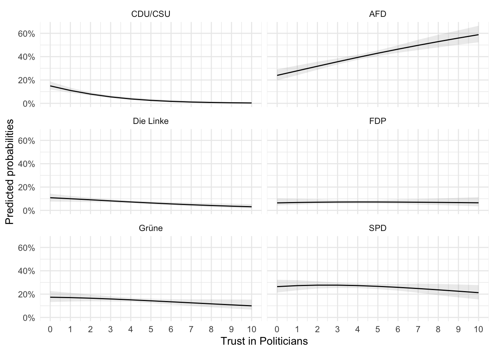
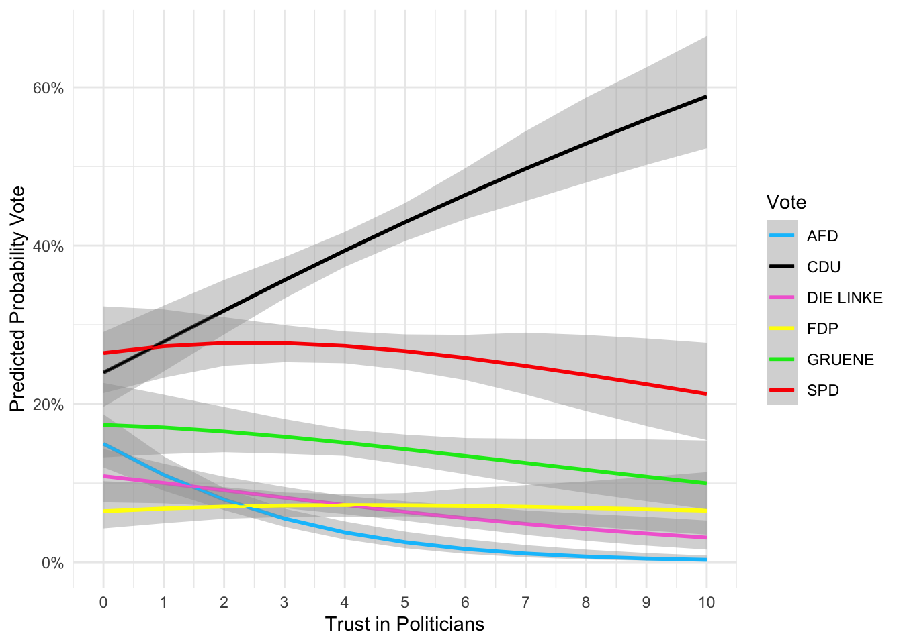
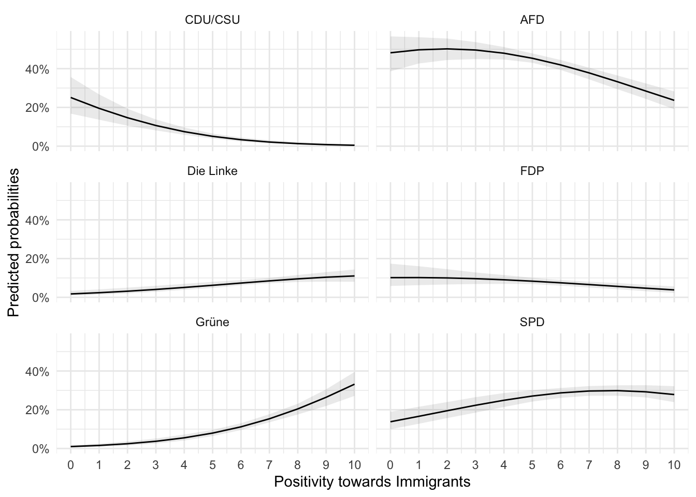
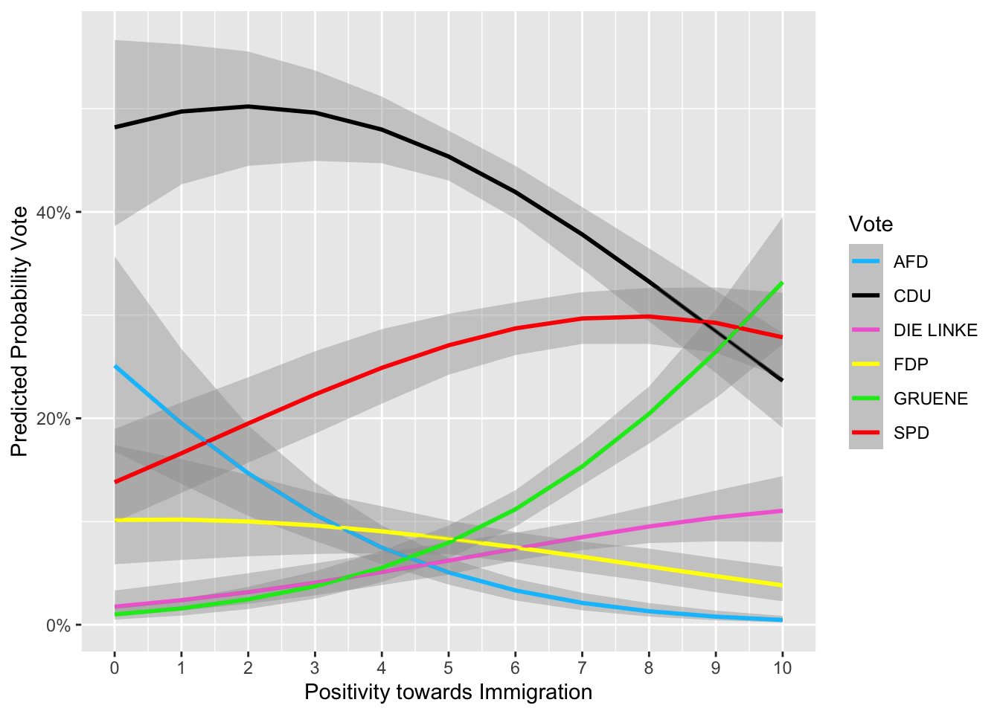

```{=html}
<style>body {text-align: right}</style>
```


## Introduction

In this script, I will show you how to construct a multinomial logistic regression in R. For this, we will work on the *European Social Survey* (ESS) again. These are the main points that are covered in this script:

1.  The logic of multinomial (logistic) regressions
2.  Advanced Data Management
3.  Interpretation of a multinomial Model
4.  Model Diagnostics
5.  Goodness of Fit
6.  APIs and Data Visualization (OPTIONAL!)

## The Logic of multinomial (logistic) Regressions

I have chosen four countries out of which you will be able to choose one later one when I ask you to work on some exercises. For now, I will mainly work on Germany. One of the classic applications of multinomial models in political science is the question of voting behavior, more precisely vote choice. Last week, we have seen models of a logistic regression (logit). It is used in cases when our dependent variable (DV) is binary (0 or 1; true or false; yes or no) which means that we are not allowed to use OLS. The idea of logit can be extended to *unordered categorical or nominal variables* with more than **two** categories, e.g.: Vote choice, Religion, Brands...

Instead of one equation modelling the log-odds of $P(X=1)$, we do the same thing but for the amount of categories that we have. In fact, this means that a multinomial model runs several single logistic regressions on something we call a *baseline.* R will choose this baseline to which the categorical values of our DV will then relate. But we can also change it (this is called releveling). This allows us to make very interesting inferences with categorical (or ordinal) variables. If this sounds confusing, you should trust me when I tell you that this will become more straightforward in a second!

However, this also makes the interpretation of these models a bit intricate and opaque at times. Nevertheless, you will see that once you have understood the basic idea of a multinomial regression and how to interpret the values in accordance to the baseline, it is not much different from logistic regressions on binary variables (and in my eyes even a bit simpler...). If the logic of logit is not 100% clear at this point, I recommend you go back to last session's script on logit and work through my explanations. And if that does not help, try to follow this lecture attentively. As I said, the logic is the same, so I will repeat myself :) And if it is still unclear, you can always ask in class or come see me after the session!

But enough small talk, let's first do some data wrangling which you all probably dread at this point...

## Data Management for Multinomial Regression

As I have said, we will work on voting choice in four different countries. I selected Denmark and Germany. Germany I have chosen because I was working on this model a couple of months ago and Denmark is for fun.

The data which we will use for this session is the 9th round of the ESS published in 2018. The goal of this session is to understand predictors that tell us more about why people vote for Populist Radical-Right Parties, henceforth called *PRRP* (Mudde 2007). For this I have two main hypotheses in mind, as well as some predictors which I know are important based on the literature. Finally we also need some control variables which we need to control for in almost any regression analysis using survey data.

My two hypotheses (**H1**) and **H2**) are as follows:

> **H1**: Thinking that immigrants enrich a country's culture decreases the likelihood of voting for PRRPs.
>
> **H2**: Having less trust in politicians increases the likelihood of voting for PRRPs than voting for other parties.

Now you might notice two things. First, my hypotheses are relatively self-explanatory and you are absolutely right. They are more than that, they are perhaps even self-evident. But to this, I would just reply that this is supposed to be an easy exercise which is supposed to expose you to a multinomial regression and the logic of it. Second, you might see that my hypotheses are relatively broadly formulated. This is because I would like you, later in class, to choose one of the countries of the 9th wave of the ESS and build a model yourselves. By giving you broad hypotheses, you can do this ;)


::: {.cell}

```{.r .cell-code}
# read_csv from the tidyverse package
ess <- read_csv("ESS9e03_1.csv") |> 
  # dplyr allows me to select only those variables I want to use later
  select(cntry, 
         prtvtdfr, 
         prtvede1, 
         prtvtddk, 
         prtvtdpl, 
         imueclt, 
         yrbrn, 
         eduyrs, 
         hinctnta, 
         stflife, 
         trstplt, 
         blgetmg, 
         gndr) |> 
  # based on the selected variables, I filter the dataframe so that I am only
  # left with the data for Germany and Denmark
  filter(cntry %in% c("DE", "DK"))
```

::: {.cell-output .cell-output-stderr}

```
Rows: 49519 Columns: 572
── Column specification ────────────────────────────────────────────────────────
Delimiter: ","
chr  (10): name, proddate, cntry, ctzshipd, cntbrthd, lnghom1, lnghom2, fbrn...
dbl (562): essround, edition, idno, dweight, pspwght, pweight, anweight, pro...

ℹ Use `spec()` to retrieve the full column specification for this data.
ℹ Specify the column types or set `show_col_types = FALSE` to quiet this message.
```


:::
:::


Again, every transformation and mutation of variables which you see below is done based on my knowledge of the dataset which I solely gained from looking at the code book. The code book can be found on the Moodle page (or the ESS' website). It is highly important that you get used to reading a code book in general but especially to familiarize yourselves with the data which you will use by looking at the way that the variables are coded **in the code book**. There, for example, you will find information on the numeric values which are stored in the variables `prtvtdfr`, `prtvede1`, `prtvtddk` and `prtvtdpl`. They all stand for a category or, in our case, a party name which you can only identify if you open the code book. You will see that I only selected some parties in the `mutate()` function below. This is more or less to get rid of those parties that did not make it into the national parliament at the last national election of each country.

You have seen a similar chunk of code in the last script. See how, once you have a code that works for one dataset, you can use it again?


::: {.cell}

```{.r .cell-code}
# cleaning the dependent variables all over the dataframe
ess_clean <- ess |>
    mutate(across(where(is.numeric), ~case_when(
           . %in% c(66, 77, 88, 99, 7777, 8888, 9999) ~ NA_integer_,
           TRUE ~ .)),
      prtvtdfr = replace(prtvtdfr, prtvtdfr %in% c(1, 2, 10, 12:99), NA),
           prtvede1 = replace(prtvede1, !prtvede1 %in% c(1:6), NA),
           prtvtddk = replace(prtvtddk, !prtvtddk %in% c(1:10), NA),
           prtvtdpl = replace(prtvtdpl, !prtvtdpl %in% c(1:8), NA),
           # get rid of unwanted values indicating no response etc
           blgetmg = replace(blgetmg, !blgetmg %in% c(1:2), NA),
           # gender recoded to 1 = 0, 2 = 1 (my personal preference)
           gndr = recode(gndr, `1` = 0, `2` = 1))
```
:::


In fact, you could already build the model now and start the multinomial regression. However, I add an additional data management step by placing the numeric values of the election variable in a new variable called `vote_de`, where I convert the numeric values to character values and at the same time give them the names of the parties. This will automatically transform NAs in all the rows in which the country is not that in which the person has voted.

But more importantly, once I run the regression, it will display the parties' names instead of the numbers. This means that I won't have to go back to the code book every time to check what the 1s or 2s correspond to.


::: {.cell}

```{.r .cell-code}
# this is simple base R creating a new column/variable with character
# values corresponding to the parties' names behind the numeric values
ess_clean$vote_de[ess_clean$prtvede1==1]<-"CDU/CSU"
ess_clean$vote_de[ess_clean$prtvede1==2]<-"SPD"
ess_clean$vote_de[ess_clean$prtvede1==3]<-"Die Linke"
ess_clean$vote_de[ess_clean$prtvede1==4]<-"Grüne"
ess_clean$vote_de[ess_clean$prtvede1==5]<-"FDP"
ess_clean$vote_de[ess_clean$prtvede1==6]<-"AFD"
```
:::


Here is a way to mutate all the variables at once. However, this somehow creates conflicts with a package used further below.


::: {.cell}

```{.r .cell-code}
ess_clean <- ess_clean |> 
  mutate(
    vote_dk = case_when(prtvtddk == 1 ~ "Socialdemokratiet",
                        prtvtddk == 2 ~ "Det Radikale Venstre",
                        prtvtddk == 3 ~ "Det Konservative Folkeparti",
                        prtvtddk == 4 ~ "SF Socialistisk Folkeparti",
                        prtvtddk == 5 ~ "Dansk Folkeparti",
                        prtvtddk == 6 ~ "Kristendemokraterne",
                        prtvtddk == 7 ~ "Venstre",
                        prtvtddk == 8 ~ "Liberal Alliance",
                        prtvtddk == 9 ~ "Enhedslisten",
                        prtvtddk == 10 ~ "Alternativet",
                        TRUE ~ NA_character_),
    vote_de = case_when(prtvede1 == 1 ~ "CDU/CSU",
                        prtvede1 == 2 ~ "SPD",
                        prtvede1 == 3 ~ "Die Linke",
                        prtvede1 == 4 ~ "Grüne",
                        prtvede1 == 5 ~ "FDP",
                        prtvede1 == 6 ~ "AFD"))
```
:::


## Constructing the Model

Now that the data management process is finally over, we can specify our model. For this, you need to install the `nnet` package and load it to your library. Once this is done, we will take the exact same steps as you would do for an OLS or logit model. You specify your DV followed by a `~` and then you only need to add all your IVs. Lastly, you need to specify the data source. `Hess = TRUE` will provide us with a Hessian matrix that we need for a package later. If you don't know what that is... that is absolutely fine!


::: {.cell}

```{.r .cell-code}
library(nnet)
model_de <- multinom(vote_de ~ imueclt  + stflife + trstplt + blgetmg + 
                    gndr + yrbrn + eduyrs + hinctnta,
                     data = ess_clean,
                     Hess = TRUE)
```

::: {.cell-output .cell-output-stdout}

```
# weights:  60 (45 variable)
initial  value 2512.046776 
iter  10 value 2043.014063
iter  20 value 2023.586615
iter  30 value 1980.080494
iter  40 value 1938.289705
iter  50 value 1927.868641
iter  60 value 1926.043042
iter  70 value 1925.949503
iter  80 value 1925.873772
final  value 1925.814902 
converged
```


:::

```{.r .cell-code}
model_dk <- multinom(vote_dk ~ imueclt  + stflife + trstplt + blgetmg + gndr +
                     yrbrn + eduyrs + hinctnta,
                     data = ess_clean,
                     Hess = TRUE)
```

::: {.cell-output .cell-output-stdout}

```
# weights:  100 (81 variable)
initial  value 2525.935847 
iter  10 value 2265.701974
iter  20 value 2136.112054
iter  30 value 2056.238932
iter  40 value 1999.847654
iter  50 value 1950.379411
iter  60 value 1938.124756
iter  70 value 1934.172909
iter  80 value 1915.231553
iter  90 value 1908.197162
iter 100 value 1906.641552
final  value 1906.641552 
stopped after 100 iterations
```


:::
:::


### Re-leveling your DV

In my case, the German PRRP is called *Alternative für Deutschland* meaning it starts with an "A". R tends to take the alphabetical order as a criterion for the baseline meaning that the baseline for your multinomial model is chosen based on the party which comes first in alphabetical order. Depending on what you want to show, you might want to change the baseline which we can do with the `relevel()` function. Let's say we are not interested in vote choice regarding the PRRP but conservative parties and thus want to put the German Christian conservative party, the CDU/CSU, as a baseline. Here is how we could do this in R:


::: {.cell}

```{.r .cell-code}
# don't run this code chunk
#| eval: false
# you need to specify your DV as a factor for this; further, the ref must 
# contain the exact character label of the party
ess_clean$vote_de <- relevel(as.factor(ess_clean$vote_de), ref = "CDU/CSU")
```
:::


## Interpreting a Multinomial Model

You already know that I like the `stargazer` package for displaying a regression table. This time I paid attention to what level of statistical significance leads to a star (\*). I changed it so that, like in the `summary()` function, p-values below 0.05 will be used as the minimum level of statistical significance instead of 0.1. `dep.var.caption =` allows be to specify a caption for our DV and we can use our own labels for the IVs instead of the variables' names by using the `covariate.labels =` argument.

I have specified in the first chunk of code which arguments concern the generated output in LaTeX. I still recommend you start learning how to write papers in LaTeX. This is just to say that some arguments are not useful at all when `type = "text`. But LaTeX generates more beautiful tables ;)


::: {.cell layout-align="center"}

```{.r .cell-code}
# specifying the object in which the model is stored
stargazer::stargazer(
  model_de,
  # adding a title to the table
  title = "Multinomial Regression Results Germany",
  # change this to the desired output format; either
  # LaTeX, html, or text (depending on your document)
  # editor
  type = "html",
  # some LaTeX information
  float = TRUE,
  # font size of the LaTeX table
  font.size = "small",
  # column width in final LaTeX table
  column.sep.width = "-10pt",
  # specifying the p-values which lead to stars in our
  # table
  star.cutoffs = c(.05, .01, .001),
  # caption for the DV
  dep.var.caption = c("Vote Choice"),
  # labels for our IVs; must be in the same order as our
  # IVs in the initial model
  covariate.labels = c(
    "Positivity Immigration",
    "Satisfaction w/ Life",
    "Trust in Politicians",
    "Ethnic Minority",
    "Gender",
    "Age",
    "Education",
    "Income"
  )
)
```


<table style="text-align:center"><caption><strong>Multinomial Regression Results Germany</strong></caption>
<tr><td colspan="6" style="border-bottom: 1px solid black"></td></tr><tr><td style="text-align:left"></td><td colspan="5">Vote Choice</td></tr>
<tr><td></td><td colspan="5" style="border-bottom: 1px solid black"></td></tr>
<tr><td style="text-align:left"></td><td>CDU/CSU</td><td>Die Linke</td><td>FDP</td><td>Grüne</td><td>SPD</td></tr>
<tr><td style="text-align:left"></td><td>(1)</td><td>(2)</td><td>(3)</td><td>(4)</td><td>(5)</td></tr>
<tr><td colspan="6" style="border-bottom: 1px solid black"></td></tr><tr><td style="text-align:left">Positivity Immigration</td><td>0.350<sup>***</sup></td><td>0.617<sup>***</sup></td><td>0.326<sup>***</sup></td><td>0.784<sup>***</sup></td><td>0.493<sup>***</sup></td></tr>
<tr><td style="text-align:left"></td><td>(0.063)</td><td>(0.080)</td><td>(0.076)</td><td>(0.075)</td><td>(0.065)</td></tr>
<tr><td style="text-align:left"></td><td></td><td></td><td></td><td></td><td></td></tr>
<tr><td style="text-align:left">Satisfaction w/ Life</td><td>0.029</td><td>-0.171<sup>*</sup></td><td>0.095</td><td>-0.094</td><td>-0.109</td></tr>
<tr><td style="text-align:left"></td><td>(0.067)</td><td>(0.083)</td><td>(0.093)</td><td>(0.079)</td><td>(0.067)</td></tr>
<tr><td style="text-align:left"></td><td></td><td></td><td></td><td></td><td></td></tr>
<tr><td style="text-align:left">Trust in Politicians</td><td>0.513<sup>***</sup></td><td>0.281<sup>**</sup></td><td>0.424<sup>***</sup></td><td>0.352<sup>***</sup></td><td>0.398<sup>***</sup></td></tr>
<tr><td style="text-align:left"></td><td>(0.077)</td><td>(0.092)</td><td>(0.090)</td><td>(0.085)</td><td>(0.078)</td></tr>
<tr><td style="text-align:left"></td><td></td><td></td><td></td><td></td><td></td></tr>
<tr><td style="text-align:left">Ethnic Minority</td><td>-0.054<sup>***</sup></td><td>-0.443<sup>***</sup></td><td>-1.086<sup>***</sup></td><td>-0.382<sup>***</sup></td><td>-0.385<sup>***</sup></td></tr>
<tr><td style="text-align:left"></td><td>(0.002)</td><td>(0.001)</td><td>(0.001)</td><td>(0.002)</td><td>(0.002)</td></tr>
<tr><td style="text-align:left"></td><td></td><td></td><td></td><td></td><td></td></tr>
<tr><td style="text-align:left">Gender</td><td>0.859<sup>***</sup></td><td>0.240<sup>*</sup></td><td>0.573<sup>***</sup></td><td>0.928<sup>***</sup></td><td>0.395<sup>***</sup></td></tr>
<tr><td style="text-align:left"></td><td>(0.103)</td><td>(0.096)</td><td>(0.095)</td><td>(0.137)</td><td>(0.112)</td></tr>
<tr><td style="text-align:left"></td><td></td><td></td><td></td><td></td><td></td></tr>
<tr><td style="text-align:left">Age</td><td>-0.013<sup>***</sup></td><td>0.007<sup>***</sup></td><td>-0.010<sup>***</sup></td><td>-0.002<sup>***</sup></td><td>-0.016<sup>***</sup></td></tr>
<tr><td style="text-align:left"></td><td>(0.0004)</td><td>(0.0005)</td><td>(0.001)</td><td>(0.0005)</td><td>(0.0004)</td></tr>
<tr><td style="text-align:left"></td><td></td><td></td><td></td><td></td><td></td></tr>
<tr><td style="text-align:left">Education</td><td>0.014</td><td>0.081</td><td>0.036</td><td>0.091</td><td>0.040</td></tr>
<tr><td style="text-align:left"></td><td>(0.051)</td><td>(0.059)</td><td>(0.060)</td><td>(0.055)</td><td>(0.052)</td></tr>
<tr><td style="text-align:left"></td><td></td><td></td><td></td><td></td><td></td></tr>
<tr><td style="text-align:left">Income</td><td>0.116<sup>*</sup></td><td>-0.032</td><td>0.114</td><td>0.136<sup>*</sup></td><td>0.047</td></tr>
<tr><td style="text-align:left"></td><td>(0.055)</td><td>(0.066)</td><td>(0.067)</td><td>(0.062)</td><td>(0.056)</td></tr>
<tr><td style="text-align:left"></td><td></td><td></td><td></td><td></td><td></td></tr>
<tr><td style="text-align:left">Constant</td><td>23.264<sup>***</sup></td><td>-16.715<sup>***</sup></td><td>17.583<sup>***</sup></td><td>-1.578<sup>***</sup></td><td>30.969<sup>***</sup></td></tr>
<tr><td style="text-align:left"></td><td>(0.0001)</td><td>(0.00005)</td><td>(0.0001)</td><td>(0.0001)</td><td>(0.0001)</td></tr>
<tr><td style="text-align:left"></td><td></td><td></td><td></td><td></td><td></td></tr>
<tr><td colspan="6" style="border-bottom: 1px solid black"></td></tr><tr><td style="text-align:left">Akaike Inf. Crit.</td><td>3,941.630</td><td>3,941.630</td><td>3,941.630</td><td>3,941.630</td><td>3,941.630</td></tr>
<tr><td colspan="6" style="border-bottom: 1px solid black"></td></tr><tr><td style="text-align:left"><em>Note:</em></td><td colspan="5" style="text-align:right"><sup>*</sup>p<0.05; <sup>**</sup>p<0.01; <sup>***</sup>p<0.001</td></tr>
</table>
:::

::: {.cell layout-align="center"}

```{.r .cell-code}
# the annotations of the above model would be the same for this model
stargazer::stargazer(
  model_dk,
  title = "Multinomial Regression Results Denmark",
  type = "html",
  float = TRUE,
  font.size = "tiny",
  star.cutoffs = c(.05, .01, .001),
  dep.var.labels = c("Germany"),
  dep.var.caption = c("Vote Choice"),
  covariate.labels = c(
    "Positivity Immigration",
    "Satisfaction w/ Life",
    "Trust in Politicians",
    "Ethnic Minority",
    "Gender",
    "Age",
    "Education",
    "Income"
  )
)
```


<table style="text-align:center"><caption><strong>Multinomial Regression Results Denmark</strong></caption>
<tr><td colspan="10" style="border-bottom: 1px solid black"></td></tr><tr><td style="text-align:left"></td><td colspan="9">Vote Choice</td></tr>
<tr><td></td><td colspan="9" style="border-bottom: 1px solid black"></td></tr>
<tr><td style="text-align:left"></td><td>Germany</td><td>Det Konservative Folkeparti</td><td>Det Radikale Venstre</td><td>Enhedslisten</td><td>Kristendemokraterne</td><td>Liberal Alliance</td><td>SF Socialistisk Folkeparti</td><td>Socialdemokratiet</td><td>Venstre</td></tr>
<tr><td style="text-align:left"></td><td>(1)</td><td>(2)</td><td>(3)</td><td>(4)</td><td>(5)</td><td>(6)</td><td>(7)</td><td>(8)</td><td>(9)</td></tr>
<tr><td colspan="10" style="border-bottom: 1px solid black"></td></tr><tr><td style="text-align:left">Positivity Immigration</td><td>-0.667<sup>***</sup></td><td>-0.440<sup>***</sup></td><td>-0.018</td><td>0.162<sup>*</sup></td><td>-0.169</td><td>-0.403<sup>***</sup></td><td>0.028</td><td>-0.238<sup>***</sup></td><td>-0.400<sup>***</sup></td></tr>
<tr><td style="text-align:left"></td><td>(0.066)</td><td>(0.083)</td><td>(0.084)</td><td>(0.081)</td><td>(0.133)</td><td>(0.087)</td><td>(0.084)</td><td>(0.059)</td><td>(0.060)</td></tr>
<tr><td style="text-align:left"></td><td></td><td></td><td></td><td></td><td></td><td></td><td></td><td></td><td></td></tr>
<tr><td style="text-align:left">Satisfaction w/ Life</td><td>0.153<sup>*</sup></td><td>0.238</td><td>0.132</td><td>-0.043</td><td>0.174</td><td>0.164</td><td>0.071</td><td>0.081</td><td>0.249<sup>***</sup></td></tr>
<tr><td style="text-align:left"></td><td>(0.070)</td><td>(0.131)</td><td>(0.109)</td><td>(0.082)</td><td>(0.176)</td><td>(0.125)</td><td>(0.098)</td><td>(0.059)</td><td>(0.069)</td></tr>
<tr><td style="text-align:left"></td><td></td><td></td><td></td><td></td><td></td><td></td><td></td><td></td><td></td></tr>
<tr><td style="text-align:left">Trust in Politicians</td><td>0.180<sup>**</sup></td><td>0.349<sup>***</sup></td><td>0.300<sup>***</sup></td><td>0.003</td><td>0.334<sup>*</sup></td><td>0.298<sup>**</sup></td><td>0.103</td><td>0.264<sup>***</sup></td><td>0.451<sup>***</sup></td></tr>
<tr><td style="text-align:left"></td><td>(0.068)</td><td>(0.093)</td><td>(0.086)</td><td>(0.076)</td><td>(0.144)</td><td>(0.095)</td><td>(0.082)</td><td>(0.061)</td><td>(0.064)</td></tr>
<tr><td style="text-align:left"></td><td></td><td></td><td></td><td></td><td></td><td></td><td></td><td></td><td></td></tr>
<tr><td style="text-align:left">Ethnic Minority</td><td>0.557<sup>***</sup></td><td>23.666<sup>***</sup></td><td>-0.386<sup>***</sup></td><td>-0.389<sup>***</sup></td><td>11.010<sup>***</sup></td><td>0.596<sup>***</sup></td><td>0.179<sup>***</sup></td><td>-0.430<sup>***</sup></td><td>0.494<sup>***</sup></td></tr>
<tr><td style="text-align:left"></td><td>(0.001)</td><td>(0.0003)</td><td>(0.002)</td><td>(0.006)</td><td>(0.0004)</td><td>(0.001)</td><td>(0.002)</td><td>(0.004)</td><td>(0.001)</td></tr>
<tr><td style="text-align:left"></td><td></td><td></td><td></td><td></td><td></td><td></td><td></td><td></td><td></td></tr>
<tr><td style="text-align:left">Gender</td><td>-0.617<sup>***</sup></td><td>-0.128<sup>**</sup></td><td>-0.378<sup>***</sup></td><td>-0.030</td><td>-0.706<sup>***</sup></td><td>-0.507<sup>***</sup></td><td>0.204</td><td>-0.164</td><td>-0.182</td></tr>
<tr><td style="text-align:left"></td><td>(0.185)</td><td>(0.047)</td><td>(0.106)</td><td>(0.204)</td><td>(0.007)</td><td>(0.029)</td><td>(0.119)</td><td>(0.130)</td><td>(0.138)</td></tr>
<tr><td style="text-align:left"></td><td></td><td></td><td></td><td></td><td></td><td></td><td></td><td></td><td></td></tr>
<tr><td style="text-align:left">Age</td><td>-0.023<sup>***</sup></td><td>-0.024<sup>***</sup></td><td>-0.001</td><td>-0.008<sup>***</sup></td><td>-0.005<sup>***</sup></td><td>0.054<sup>***</sup></td><td>-0.010<sup>***</sup></td><td>-0.024<sup>***</sup></td><td>-0.025<sup>***</sup></td></tr>
<tr><td style="text-align:left"></td><td>(0.001)</td><td>(0.001)</td><td>(0.001)</td><td>(0.001)</td><td>(0.001)</td><td>(0.001)</td><td>(0.001)</td><td>(0.0005)</td><td>(0.001)</td></tr>
<tr><td style="text-align:left"></td><td></td><td></td><td></td><td></td><td></td><td></td><td></td><td></td><td></td></tr>
<tr><td style="text-align:left">Education</td><td>-0.144<sup>***</sup></td><td>-0.035</td><td>-0.017</td><td>-0.052</td><td>-0.083</td><td>-0.036</td><td>-0.042</td><td>-0.103<sup>***</sup></td><td>-0.105<sup>***</sup></td></tr>
<tr><td style="text-align:left"></td><td>(0.033)</td><td>(0.038)</td><td>(0.035)</td><td>(0.034)</td><td>(0.060)</td><td>(0.045)</td><td>(0.036)</td><td>(0.029)</td><td>(0.030)</td></tr>
<tr><td style="text-align:left"></td><td></td><td></td><td></td><td></td><td></td><td></td><td></td><td></td><td></td></tr>
<tr><td style="text-align:left">Income</td><td>-0.023</td><td>0.216<sup>**</sup></td><td>0.118</td><td>-0.067</td><td>-0.165</td><td>0.162<sup>*</sup></td><td>-0.050</td><td>-0.008</td><td>0.070</td></tr>
<tr><td style="text-align:left"></td><td>(0.064)</td><td>(0.081)</td><td>(0.071)</td><td>(0.065)</td><td>(0.115)</td><td>(0.080)</td><td>(0.069)</td><td>(0.057)</td><td>(0.059)</td></tr>
<tr><td style="text-align:left"></td><td></td><td></td><td></td><td></td><td></td><td></td><td></td><td></td><td></td></tr>
<tr><td style="text-align:left">Constant</td><td>48.626<sup>***</sup></td><td>-1.783<sup>***</sup></td><td>0.004<sup>***</sup></td><td>17.170<sup>***</sup></td><td>-12.969<sup>***</sup></td><td>-107.485<sup>***</sup></td><td>18.189<sup>***</sup></td><td>51.982<sup>***</sup></td><td>50.057<sup>***</sup></td></tr>
<tr><td style="text-align:left"></td><td>(0.0001)</td><td>(0.0001)</td><td>(0.0002)</td><td>(0.0001)</td><td>(0.0002)</td><td>(0.0001)</td><td>(0.0001)</td><td>(0.0001)</td><td>(0.0002)</td></tr>
<tr><td style="text-align:left"></td><td></td><td></td><td></td><td></td><td></td><td></td><td></td><td></td><td></td></tr>
<tr><td colspan="10" style="border-bottom: 1px solid black"></td></tr><tr><td style="text-align:left">Akaike Inf. Crit.</td><td>3,975.283</td><td>3,975.283</td><td>3,975.283</td><td>3,975.283</td><td>3,975.283</td><td>3,975.283</td><td>3,975.283</td><td>3,975.283</td><td>3,975.283</td></tr>
<tr><td colspan="10" style="border-bottom: 1px solid black"></td></tr><tr><td style="text-align:left"><em>Note:</em></td><td colspan="9" style="text-align:right"><sup>*</sup>p<0.05; <sup>**</sup>p<0.01; <sup>***</sup>p<0.001</td></tr>
</table>
:::


The format of the regression table on our Danish model is not ideal since the names of the parties are quite long and overlap. Blame this on my lack of knowledge of abbreviations of Danish parties...

## Interpreting a Multinomial Regression Table

We can see that many many things are going on in this regression table. Let us try to analyze our results step by step.

First of all, we can see that we have many variables that are statistically significant (lots of stars yay!). This is always a good sign. Note also that the baseline was the party *AFD*. You can see this based on the fact that the category AFD which our DV can take on is not given in our table. This means that whenever we see the results where the DV is one of the parties, R has calculated the coefficients based on the logic that the respondent would have voter for *either* the party in the dependent variable *or* the party of the baseline, which in our case is that of the AFD. In more mathematical terms these are several single logistic regressions always with regards to the baseline AFD which are then aggregated to a multinomial regression. And to be slightly more mathematical, this means our DV is technically: $1 = DV$ and then $0 = AFD$.

Therefore, we can interpret the results exactly like we would for a logistic regression. Last week it was about the likelihood of voting abstention, this week it is the likelihood of voting for the CDU/CSU instead of the AFD, or voting for the SPD instead of the AFD, or voting for Die Linke instead of the AFD, and so on. You get the idea hopefully.

Remember that these are the coefficients of logistic regressions. We cannot interpret them linearily like in OLS. For now, the regression table tells us something about the statistical significance of our predictors and the direction of association: whether or not a statistically significant predictor increases or decreases the likelihood of voting for either or.

### The Hypotheses

As a reminder, these were my initial (frankly also bad) hypotheses:

> **H1**: Thinking that immigrants enrich a country's culture decreases the likelihood of voting for PRRPs.
>
> **H2**: Having less trust in politicians increases the likelihood of voting for PRRPs than voting for other parties.

I am now interested to see the effect of positivity toward migration and trust in politicians *on* the vote choice for each party *instead* of the AFD. What we can see is that a one-unit increase in positive attitudes toward migration (thinking that immigrants culturally enrich the respondents' country) raises the likelihood for voting for all other parties *instead* of voting for the AFD. In the case of the first column, in which the vote was either for the CDU/CSU or the AFD, a one unit increase in stances on immigration results in a higher likelihood of voting of voting for the CDU/CSU than the AFD.

If we now turn to trust in politicians and this variable's effect on vote choice for the different German parties, we can see that overall there is a statistically significant a positive association with having more trust in politicians and also voting for other parties than the AFD. In return, this also means that low trust in politicians raises the likelihood of voting for the AFD.

You could obviously exponentiate the values that we have here in order to get the odds-ratio. But I have tortured you enough with ORs and predicted probabilities are much more intuitively interpreted. Therefore, we will calculate them in the next section.

## Predicted Probabilities

You all hopefully still remember the idea of *predicted probabilities* which we have already seen last time for a simply logistic regression. You hold all but one predictor variables (IVs) constant at their mean or another logical value. The one predictor which you do not hold constant you let alternate/vary to estimate the predicted probabilities of this specific variable of interest and the different values it can take on (on your dependent variable). The predicted probabilities can be tricky to code manually and we are not going to do this again but we will use a package that can do this for us.

The package is called `MNLpred` and allows us to specify the variable of interest. This packages makes draws from our posterior distribution (hello Bayesian statistics) and simulates our coefficients n-times (we tell it how many times to run the simulation) and then takes the mean value of all of our simulations. \footnote{Since R will simulate many many things at the same time, your knit might take more time than usually. This is perfectly normal.} This way, we end up more or less with the same predicted probabilities that we have seen last week. These are much more easily interpreted than relative risk ratios (the odds-ratios of multinomial regressions) and can be plotted.


::: {.cell}

```{.r .cell-code}
library(MNLpred)
pred1 <- mnl_pred_ova(
  model = model_de,
  # specify data source
  data = ess_clean,
  # specify predictor of interest
  x = "imueclt",
  # the steps which should be used for the simulated prediction
  by = 1,
  # this would be for replicability, we do not care about it
  # here
  seed = "random",
  # number of simulations
  nsim = 100,
  # confidence intervals
  probs = c(0.025, 0.975)
)
```

::: {.cell-output .cell-output-stdout}

```
Multiplying values with simulated estimates:
================================================================================
Applying link function:
================================================================================
Done!
```


:::
:::


The `pred1` object now contains the simulated means for each party at each step of our predictor of interest meaning that there are 10 simulated mean values for each value that `imueclt` can take on for each party:


::: {.cell}

```{.r .cell-code}
pred1$plotdata |> head()
```

::: {.cell-output .cell-output-stdout}

```
  imueclt vote_de       mean      lower      upper
1       0 CDU/CSU 0.25100647 0.16781425 0.35683559
2       1 CDU/CSU 0.19511437 0.13642973 0.26716504
3       2 CDU/CSU 0.14669211 0.10542945 0.19297270
4       3 CDU/CSU 0.10654081 0.08127161 0.13764215
5       4 CDU/CSU 0.07473463 0.05855362 0.09620965
6       5 CDU/CSU 0.05066973 0.03887082 0.06462543
```


:::
:::


Let's simulate the exact same thing for our second hypothesis regarding the trust in politicians:


::: {.cell}

```{.r .cell-code}
pred2 <- mnl_pred_ova(
  model = model_de,
  data = ess_clean,
  x = "trstplt",
  by = 1,
  seed = "random",
  nsim = 100,
  probs = c(0.025, 0.975)
)
```

::: {.cell-output .cell-output-stdout}

```
Multiplying values with simulated estimates:
================================================================================
Applying link function:
================================================================================
Done!
```


:::
:::


The results, which we have both stored respectively in the objects `pred1` and `pred2` can be used for a visualization with `ggplot()`.


::: {.cell}

```{.r .cell-code}
library(ggplot2)
ggplot(data = pred2$plotdata, aes(
  x = trstplt,
  y = mean,
  ymin = lower,
  ymax = upper
)) +
  # this gives us the confidence intervals
  geom_ribbon(alpha = 0.1) +
  # taking the mean of the values
  geom_line() +
  # here we display the predicted probabilities for all parties in one plot
  facet_wrap(. ~ vote_de, ncol = 2) +
  # putting the values of the y-axis in percentages
  scale_y_continuous(labels = scales::percent_format(accuracy = 1)) +
  # the x-axis follows the 0-10 scale of the predictor
  scale_x_continuous(breaks = c(0:10)) +
  # specifying the ggplot theme
  theme_minimal() +
  # lastly you only need to label your axes; Always label your axes ;)
  labs(y = "Predicted probabilities",
       x = "Trust in Politicians") 
```

::: {.cell-output-display}
{width=672}
:::
:::


Here we can see very well by how many percent the likelihood increases or decreases for each party given that our independent variable, our predictor, of trust in politicians increases (increasing values mean more trust in politicians).

We can also visualize our predicted probabilities in one single plot. I made the effort of coordinating the colors so that they would be displayed in the colors of the parties. If you want to have a color selector to get the HEX color codes, you can click on this link: \href{https://g.co/kgs/6MxyCy}{https://g.co/kgs/6MxyCy} (it will say *Google Farbwähler*, which is not a scam but German...). As by recently, R will also display the color you have selected.


::: {.cell}

```{.r .cell-code}
ggplot(data = pred2$plotdata, aes(
  x = trstplt,
  y = mean,
  color = as.factor(vote_de)
)) +
  geom_smooth(aes(ymin = lower, ymax = upper), stat = "identity") +
  geom_line() +
  scale_y_continuous(labels = scales::percent_format(accuracy = 1)) +
  scale_x_continuous(breaks = c(0:10)) +
  scale_color_manual(
    values = c(
      "#03c2fc",
      "#000000",
      "#f26dd5",
      "#FFFF00",
      "#00e81b",
      "#fa0000"
    ),
    name = "Vote",
    labels = c("AFD", "CDU", "DIE LINKE", "FDP",
               "GRUENE", "SPD")
  ) +
  ylab("Predicted Probability Vote") +
  xlab("Trust in Politicians") +
  theme_minimal()
```

::: {.cell-output-display}
{width=672}
:::
:::


This here is the plot for our first hypothesis for which we have stored the predicted probabilities in the object `pred1`:


::: {.cell}

```{.r .cell-code}
library(ggplot2)
ggplot(data = pred1$plotdata, aes(
  x = imueclt,
  y = mean,
  ymin = lower,
  ymax = upper
)) +
  geom_ribbon(alpha = 0.1) + # Confidence intervals
  geom_line() + # Mean
  facet_wrap(. ~ vote_de, ncol = 2) +
  scale_y_continuous(labels = scales::percent_format(accuracy = 1)) + # % labels
  scale_x_continuous(breaks = c(0:10)) +
  theme_minimal() +
  labs(y = "Predicted probabilities",
       x = "Positivity towards Immigrants") # Always label your axes ;)
```

::: {.cell-output-display}
{width=672}
:::
:::


And here the code which puts all the predicted probabilities in one plot:


::: {.cell}

```{.r .cell-code}
ggplot(data = pred1$plotdata, aes(
  x = imueclt,
  y = mean,
  color = as.factor(vote_de)
)) +
  geom_smooth(aes(ymin = lower,
                  ymax = upper),
              stat = "identity") +
  geom_line() +
  scale_y_continuous(labels = scales::percent_format(accuracy = 1)) +
  scale_x_continuous(breaks = c(0:10)) +
  scale_color_manual(
    values = c(
      "#03c2fc",
      "#000000",
      "#f26dd5",
      "#FFFF00",
      "#00e81b",
      "#fa0000"
    ),
    name = "Vote",
    labels = c("AFD", "CDU", "DIE LINKE", "FDP",
               "GRUENE", "SPD")
  ) +
  ylab("Predicted Probability Vote") +
  xlab("Positivity towards Immigration")
```

::: {.cell-output-display}
{width=672}
:::
:::


## Diagnostics of Multinomial Models

I have talked about diagnostics of models before. This will be the first time that we really touch upon that in models that are not linear like OLS. Usually this is a step which you should take between the building and the final interpretation of your model.

The estimates of your model change depending on several influences. The number of predictors, the scaling of your predictors, the scaling of your dependent variable or the coding of your dependent variable. All these kind of things (and many more) will have an effect on your model's results. We need to be sure that we have a good amount of variables to account for enough variance. But we also need to make sure that we do not overfit our model, meaning that we put in too many predictors for example. We also need to make sure that our model is not biased by the scaling of our variables. This is why we need to check for multicollinearity, heteroskedasticity and other things.

We are firstly concerned with the goodness of fit of our model. In a linear model using the OLS method, we have looked at the $R^2$ and adjusted $R^2$ of the models. This tells us something about how much variance of the DV is explained by our IVs. Unfortunately, this measure does not exist for logistic or multinomial models. But the good news is that we can calculate something that is called McFadden's Pseudo $R^2$. It is interpreted in a similar way as you would do it with a normal $R^2$ meaning that anything ranging between 0.2 and 0.4 is a result that should make us happy.

This is how you do this in R:


::: {.cell}

```{.r .cell-code}
# you obviously need to install the package first
library(pscl)
```

::: {.cell-output .cell-output-stderr}

```
Classes and Methods for R originally developed in the
Political Science Computational Laboratory
Department of Political Science
Stanford University (2002-2015),
by and under the direction of Simon Jackman.
hurdle and zeroinfl functions by Achim Zeileis.
```


:::

```{.r .cell-code}
pR2(model_de)
```

::: {.cell-output .cell-output-stdout}

```
fitting null model for pseudo-r2
# weights:  12 (5 variable)
initial  value 2512.046776 
iter  10 value 2158.240962
iter  10 value 2158.240953
iter  10 value 2158.240953
final  value 2158.240953 
converged
```


:::

::: {.cell-output .cell-output-stdout}

```
          llh       llhNull            G2      McFadden          r2ML 
-1925.8149021 -2158.2409526   464.8521011     0.1076924     0.2821995 
         r2CU 
    0.2958110 
```


:::
:::


### Hetereoskedasticity and Multicollinearity

Then there are issues of scary words like *multicollinearity* or *heteroskedasticity* (oftentimes also refered to as "heteroske-something"). These two things describe two phenomena that can skew our estimations and, in the worst case scenario, will lead to wrong inferences. Therefore, we must check for them in all different kinds of models, be it a simple model using the OLS method, or a logistic regression or a multinomial regression. There are ways to test for potential problems that might arise and also ways to work our way around them if ever we encounter them.

### Multicollinearity and how to eliminate it

For now, we will only look at the potential issue of multicollinearity. It occurs when your independent variables are correlated among each other. This means that they vary very similarly in their values and measure either similar things or measure things the same way. The higher the multicollinearity within your model, the less reliable are your statistical inferences.

We can detect the amount and measure of (multi)collinearity by calculating the *Variance Inflation Factor* (VIF). It measures the amount of correlation between our predictors. The VIF should be below 10. If it is below 0.2, this is a potential problem. Anything below 0.1 should have us really worried. To do this in R, we use the `vif()` function of the `car` package. However, it does not work on the object of a multinomial model. Thus, we cheat our way around it and build a GLM model (`glm()`) in which we set our DV as factors and pretend that they are binomially distributed. This way, R sort of manually calculates the individual logistic regressions according to a baseline and we can calculate the VIF for the IVs individually.


::: {.cell}

```{.r .cell-code}
model_vif <-
  glm(
    as.factor(vote_de) ~ imueclt  + stflife + trstplt + blgetmg +
      gndr + yrbrn + eduyrs + hinctnta,
    data = ess_clean,
    family = binomial()
  )

car::vif(model_vif)
```

::: {.cell-output .cell-output-stdout}

```
 imueclt  stflife  trstplt  blgetmg     gndr    yrbrn   eduyrs hinctnta 
1.350982 1.141501 1.274526 1.013258 1.037425 1.112390 1.260009 1.202217 
```


:::
:::


Based on the results, we can see that our variance is not inflated since all values are below 10. That is great news! A VIF of 1 means that there is no correlation within our predictors, a VIF between 1 and 5 (which is quite normal) indicates slight correlation, and a VIF between 5 and 10 shows a strong correlation.

If, however, you should encounter issues of multicollinearity, you should test the VIFs for different versions of your model by starting to drop the IV with the highest VIF and see how that affects your VIFs overall. Or you check the variables which have high values, see if theoretically speaking they measure similar things, and combine them into a single measure.

It is important to do this step in order to test the validity and reliability of our models!

## Goodness of Fits and its other measures

You have seen me use the term goodness of fit before and that this becomes very important in quantitative research when you try to model statistical relationships. Until now, we have always only modeled one model and then interpreted its coefficients and model values. We have seen the $R^2$ and adjusted $R^2$ and we have mostly seen bad OLS models which showed very low values in both these measures. However, this measure does not always exist for generalized linear models. Thus, statisticians have come up with other ways to compare models and their *goodness of fit*. As a rule of thumb, we should always favor models which explain as much as possible by not making too many (strong) assumptions and overfitting our predictors, e.g. adding too many in one regression etc. In one of your introduction to (political) science classes, you might have heard of Ockham's razor\footnote{Feel free to google this concept. It is not essential but makes for a good analogy to goodness of fit of statistical models.}; this is the same idea but for statistical models.

Goodness of fit in our case refers to how well the model which we have constructed, fits the set of our made observations. Thus, goodness of fit somewhat measures the discrepancy between our observed and expected values given our model. If we do not have an adjusted $R^2$, we need to use other information criteria to determine which model fits best our data. There is quite an abundance of criteria which come to mind. Some of them are related to specific kinds of statistical models, whereas some are more general. The two which I would like to mention here are the **AIC** and the **BIC**.

### AIC (Akaike Information Criterion)

Don't be like me and think for years AIC was a bad abbreviation of Akaike. It actually stands for **A**kaike **I**nformation **C**riterion. It is calculated based on the number of predictors of our model and how well it reproduces our data (the likelihood estimation). If you go back to our multinomial regressions above, you can see that the the last line of our table shows the AIC for this model. Individually, this information criterion is meaningless. It becomes important when we compare it to an AIC of a similar model and check which one indicates a better fit.

What would a similar model look like? Well, if we dropped one of our IVs for example, we would alter the model a bit but keep its global structure. In that case, we would generate a second but different AIC. Comparing the AIC then tells us something about which model (meaning which composition of model) indicates a better fit.

What is a better AIC? The **lower** AIC indicates that the model fits our data better than the model with the higher AIC. This is simply a mathematical measure. Stand-alone values of the AIC do not tell us much. They need to be considered in comparison to other values.

### BIC (Bayesian Information Criterion)

Bayesian Statistics [^session3-1] are super fascinating and I will include them wherever I can. Luckily, the BIC is very common and is to the AIC what the adjusted $R^2$ is to the $R^2$. This means that it is a "stricter" measure of goodness of fit than the AIC. It is quite similar to the AIC but differs in that it penalizes you for adding "less useful" variables to your model (potentially *overfitting* or overcomplexifing your model). Thus, similarly to the AIC, we should also favor the **lower** BIC!

[^session3-1]: The second school of doing statistics. What we are doing is called *frequentist* statistics. Bayesian statistics are a bit more complicated and require a different way of thinking about statistics but they are the more intuitive way of conducting statistics (without p-values but with something you could call *certainty*). They are also more computationally expensive and thus, have only gained traction over the recent decades. They are gaining more and more popularity. If you are interested in learning more about them, I recommend the book by Richard McElreath (2016) [*Statistical Rethinking: A Bayesian Course with Examples in R and Stan*](https://github.com/rmcelreath/stat_rethinking_2024). He also has lectures on YouTube that follow the book. Definitely worth a try!

## APIs and Fun Data Visualization (OPTIONAL!)

In this session's optional section, I will introduce you to the logic of APIs and how to use them in R. Further, we will use data from Spotify (which we will collect through their API) to make fun data visualizations!

### What is an API?

API stands for *Application Programming Interface*. It is a way for two applications to communicate with each other. This is a very technical way of saying that an API allows us to carefully and *gently* collect data from a server, a website or a database. APIs are a very common way of collecting data from websites. Most websites use internal APIs to communicate with their own databases [^session3-2], whereas some websites also offer public APIs which allow you to collect data from their website.

[^session3-2]: This is a fun exercise for webscraping and you can imitate the websites' calls to their server API to collect data but more on that at a later point.

Think about APIs like this: You go to a restaurant and you want to eat. You could be very rude, ignore every other customer, ignore every social norm you have ever learned and go to the kitchen to tell the chef what you want. Now, if only one person did this, nothing would happen (even if I were surprised if the chef would take your order). But if now every customer did this, started yelling their order at the chef, he would probably just stop working and throw in the towel, or worse, throw you out of the restaurant. To avoid that, there are waiters and waitresses that usually come to your table, take your order, deliver that to the kitchen and once your dish is ready, you will get it to your table. Transposing this onto APIs, the waiter/waitress is our API. They make sure that we can communicate with the kitchen (the database) without disrupting the work of the chef (the server).

Usually APIs are win-win situations for us and for them. They can control how much data we collect from them, they can dictate the rules and have traces of what we were doing when and where. And we can collect data without disrupting their work. However, sometimes APIs are not public and we need to find other ways to collect data from websites. This is called *webscraping* and is a bit more complicated and in the appendix.

Some APIs are more useful than others. The [New York Times' one](https://developer.nytimes.com/) is unfortunately quite useless. Spotify's API is more fun, as we will see in a bit. Twitter used to have one of the best developer's accesses to their data through a wonderful API until he-who-must-not-be-named destroyed the platform. But also government websites have APIs which make it a bit more regulated to access their data.

### Spotify API

For the sake of the example, we will use the Spotify API to communicate with the Spotify servers and ask them for data. You usually have to sign up for an API on the respective website. If you want to reproduce my code, you will have to sign up for a Spotify API [here](https://developer.spotify.com/dashboard/login). Once you have signed up, you will be able to create a new app. This will give you a client ID and a client secret. These are your credentials to access the API. You will need them to access the API.


::: {.cell messages='false'}

```{.r .cell-code}
needs('spotifyr',
      'tidyverse',
      'plotly',
      'ggimage',
      'httpuv',
      'httr', 
      'usethis')
```
:::


### System Enivronments and API keys

We will get a bit more technical and speak about good practices in R for a second. When you apply to an API or sign up for an access, you will usually get a sort of key, clientID or something to authenticate yourself whenever you make requests to the API. This way, they know that it is you who is making requests and that you are validated by them. This information is **sensitive**! You do not share it with anyone, and you never show this to anyone. This is why you need to store it somewhere safe. One of the options we have in R is to save them in our system environment. It is a file in which we can store these things. Honestly, the keys to APIs are really long and complicated and you do not want to type them in every time you want to use them. So, we will store them in our system environment. This is a bit more complicated than just typing them in, but it is a good practice. It is also not the safest way to do it but for simplicity's sake we will do it like this for now.

::: callout-note
If you want to follow my code and run it on your end, you will have to first sign up to the Spotify developer's portal, generate the key and clientID and come back to my script then.
:::

This line of code opens up a file called `.Renviron` in which we can store our keys. If you have never done this before, it will open up a new file. If you have done this before, it will open up the file in which you probably already have things stored.


::: {.cell}

```{.r .cell-code}
usethis::edit_r_environ()
```
:::


Once you have opened the file, you can add the following lines to it. You will have to replace the `XXXX` with your own keys. Once you have done that, save the file **and restart R**! This is necessary for the changes to take effect.


::: {.cell}

```{.r .cell-code}
SPOTIFY_CLIENT_ID = "XXXX"
SPOTIFY_CLIENT_SECRET = "XXXX"
# this has to be the same localhost as in indicated in the spotify developer portal
SPOTIFY_REDIRECT_URI = "http://localhost:1410/"
```
:::


Now that we have added the sensitive information to our R Environment, it will remain there until we decide to delete it. If we need to load it now, we can run these lines of code:


::: {.cell}

```{.r .cell-code}
client_id <- Sys.getenv("SPOTIFY_CLIENT_ID")
client_secret <- Sys.getenv("SPOTIFY_CLIENT_SECRET")
redirect_uri <- Sys.getenv("SPOTIFY_REDIRECT_URI")
```
:::


```{=html}
<style>body {text-align: justify}</style>
```
